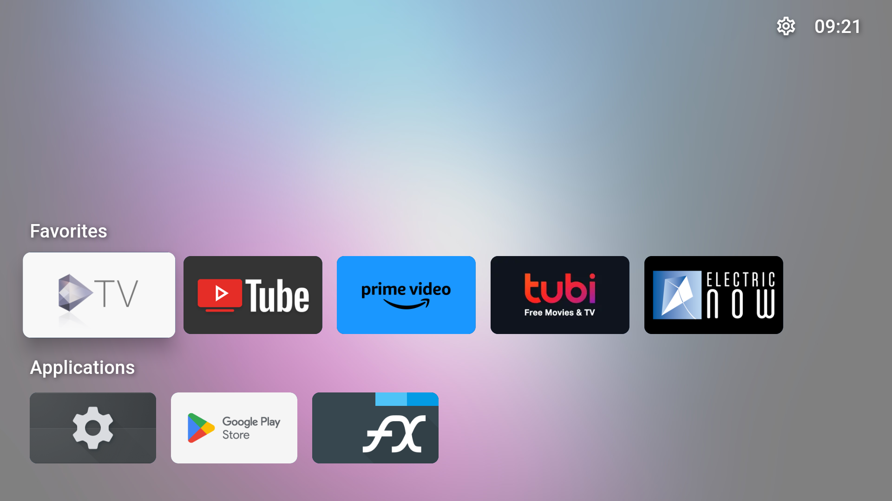
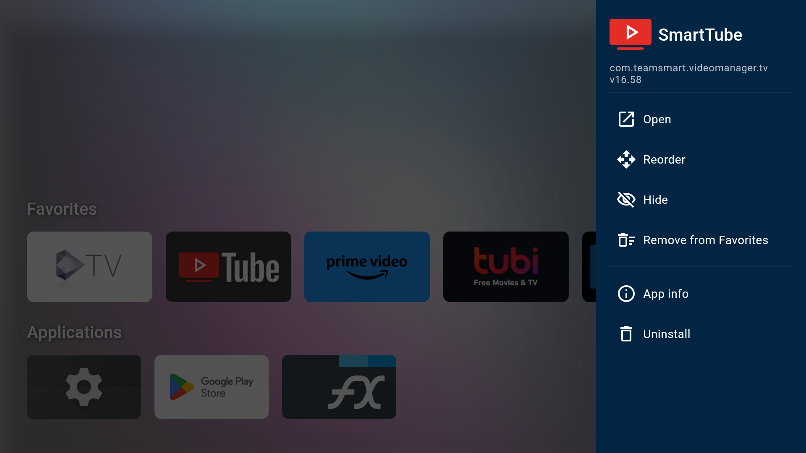
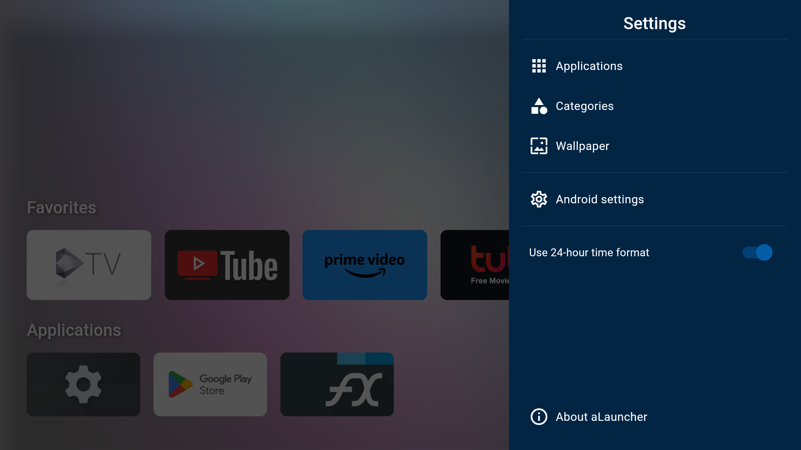

# FLauncher
FLauncher is an open-source alternative launcher for Android TV, built with [Flutter](https://flutter.dev).

The project is still at an early development stage and may be unstable. It currently lacks testing on real devices and has only been tested on Chromecast with Google TV.

<a href="https://play.google.com/store/apps/details?id=me.efesser.flauncher">
 
</a>

## Features
- [x] No ads
- [x] Customizable categories
- [x] Manually reorder apps within categories
- [x] Wallpaper support
- [x] Open "Android Settings"
- [x] Open "App info"
- [x] Uninstall app
- [x] Clock
- [x] Switch between row and grid for categories
- [x] Support for non-TV (sideloaded) apps
- [x] Navigation sound feedback
- [ ] Force stop app

## Screenshots
|  |  |  |
|--|--|--|
|  |  |  |

## Set FLauncher as default launcher

### Method 1: remap the Home button
This is the "safer" and easiest way. Use [Button Mapper](https://play.google.com/store/apps/details?id=flar2.homebutton) to remap the Home button of the remote to launch FLauncher.

### Method 2: disable the default launcher
**:warning: Disclaimer :warning:**

**You are doing this at your own risk, and you'll be responsible in any case of malfunction on your device.**

The following commands have been tested on Chromecast with Google TV only. This may be different on other devices.

Once the default launcher is disabled, press the Home button on the remote, and you'll be prompted by the system to choose which app to set as default.

#### Disable default launcher
```shell
# Disable com.google.android.apps.tv.launcherx which is the default launcher on CCwGTV
$ adb shell pm disable-user --user 0 com.google.android.apps.tv.launcherx
# com.google.android.tungsten.setupwraith will then be used as a 'fallback' and will automatically
# re-enable the default launcher, so disable it as well
$ adb shell pm disable-user --user 0 com.google.android.tungsten.setupwraith
```

#### Re-enable default launcher
```shell
$ adb shell pm enable com.google.android.apps.tv.launcherx
$ adb shell pm enable com.google.android.tungsten.setupwraith
```

#### Known issues
On Chromecast with Google TV (maybe others), the "YouTube" remote button will stop working if the default launcher is disabled. As a workaround, you can use [Button Mapper](https://play.google.com/store/apps/details?id=flar2.homebutton) to remap it correctly.

## Wallpaper
Because Android's `WallpaperManager` is not available on some Android TV devices, FLauncher implements its own wallpaper management method.

Please note that changing wallpaper requires a file explorer to be installed on the device in order to pick a file.

<a href="https://www.buymeacoffee.com/etienn01" target="_blank"></a>
